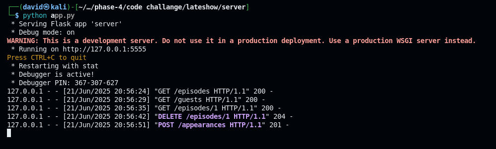
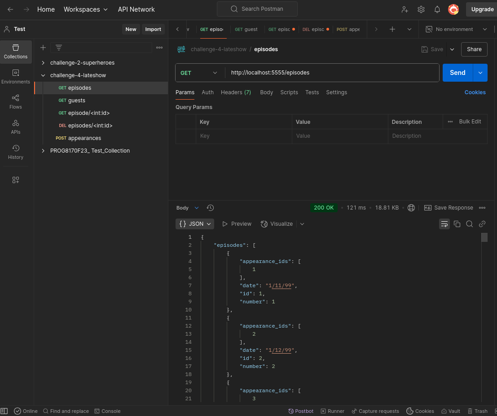
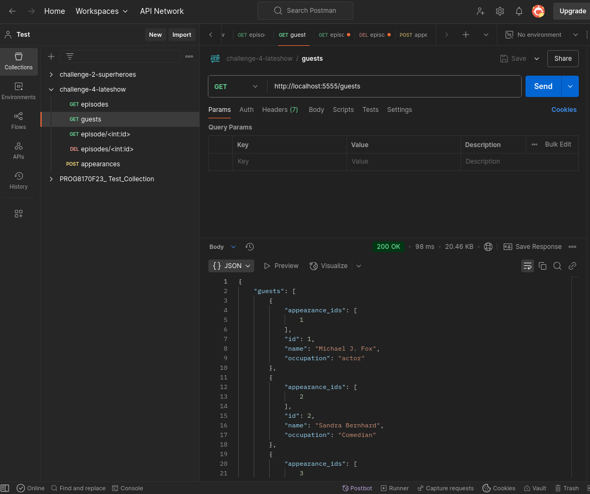
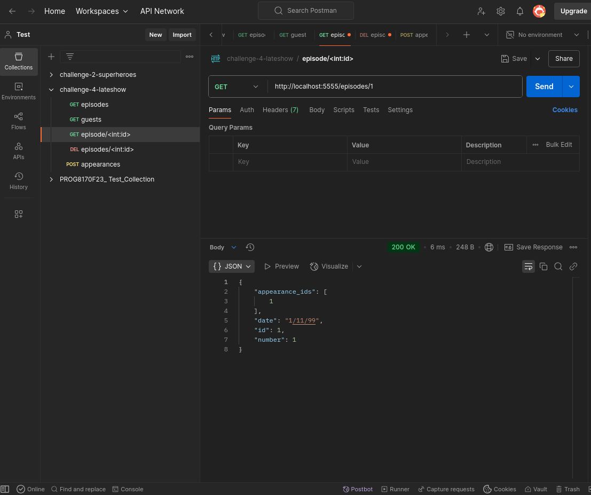
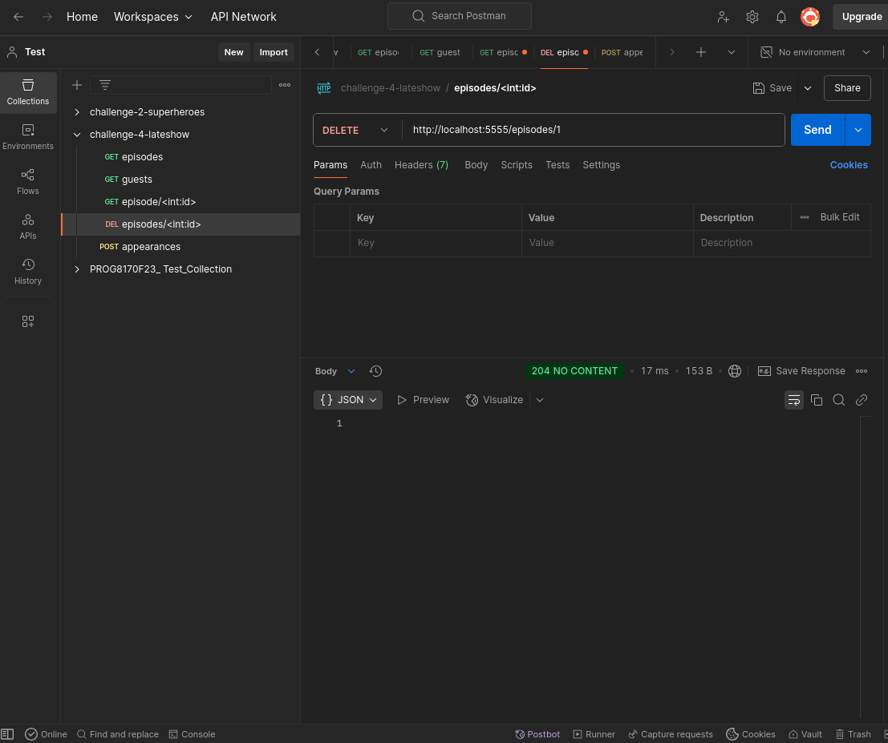
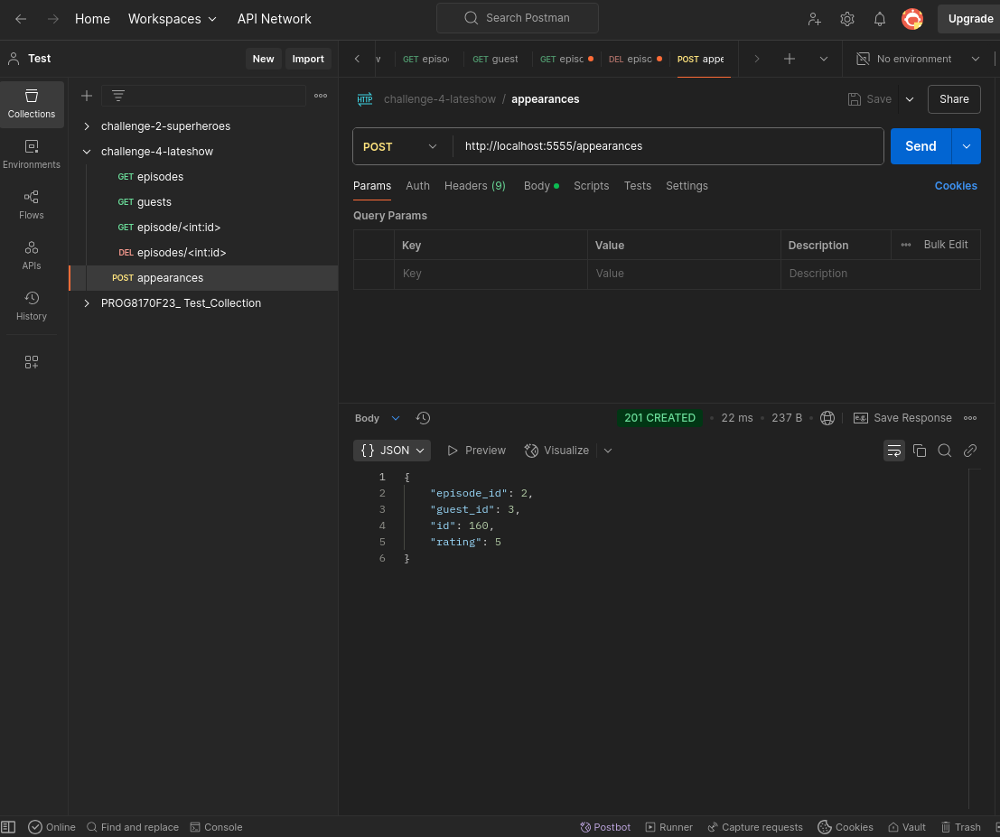

# Late Show API

## Description
This is a Flask-based API designed to manage data for a late-night talk show, including episodes, guests, and their appearances. The API provides RESTful endpoints to retrieve, create, update, and delete records, serving as a backend for managing show schedules and guest ratings. It uses SQLite as the database and includes serialization for JSON responses.

## Owner
- **Name**: @AmedDavid
- **Contact**: amukoahdavid@gmail.com

## Setup Instructions
To set up and run the Late Show API locally, follow these steps:

1. **Clone the Repository**:
   ```bash
   git clone https://github.com/AmedDavid/lateshow.git
   cd lateshow
   ```

2. **Create a Virtual Environment**:
   ```bash
   pipenv install flask flask-sqlalchemy flask-migrate sqlalchemy-serializer
   pipenv shell
   ```

3. **Set Up the Database**:
   ```bash
   cd server
   ```
   - Initialize the database and apply migrations:
     ```bash
     flask db init
     flask db migrate -m "Initial migration"
     flask db upgrade head
     ```
   - Seed the database with initial data:
     ```bash
     python seed.py
     ```

4. **Run the Application**:
   ```bash
   python app.py
   ```
   The API will be available at `http://localhost:5555`.

5. **Test the API**:
   Use `curl` or a tool like Postman to test the endpoints:
   ```bash
   curl http://localhost:5555/episodes
   curl http://localhost:5555/episodes/1
   curl http://localhost:5555/guests
   curl http://localhost:5555/guests/1
   curl -X POST -H "Content-Type: application/json" -d '{"rating": 4, "episode_id": 1, "guest_id": 1}' http://localhost:5555/appearances
   curl -X DELETE http://localhost:5555/episodes/1
   ```

## Features
- **GET /episodes**: Retrieve a list of all episodes.
- **GET /episodes/<int:id>**: Fetch details of a specific episode.
- **GET /guests**: Retrieve a list of all guests.
- **GET /guests/<int:id>**: Fetch details of a specific guest.
- **POST /appearances**: Create a new appearance with a rating, episode ID, and guest ID.
- **DELETE /episodes/<int:id>**: Delete a specific episode.



## Challenges Faced and Solutions
During development, several challenges were encountered and resolved:

1. **Recursion Error in Serialization**:
   - **Challenge**: A `RecursionError: maximum recursion depth exceeded` occurred due to circular references between `Episode`, `Guest`, and `Appearance` models in the `to_dict()` methods.
   - **Solution**: Modified `to_dict()` methods to include only IDs of related objects (e.g., `appearance_ids`) instead of full nested objects, breaking the recursion loop.

2. **Seeding Issue with Episode IDs**:
   - **Challenge**: Episode IDs started at 2 instead of 1, causing 404 errors for `/episodes/1`.
   - **Solution**: Reviewed and updated `seed.py` to ensure proper seeding, re-ran the script, and verified IDs start at 1.

3. **400 Bad Request on POST /appearances**:
   - **Challenge**: Initial POST requests to `/appearances` returned a 400 status, likely due to validation or data mismatch.
   - **Solution**: Ensured correct `episode_id` and `guest_id` values were used in the request body and validated the seeded data, resolving the issue after fixing the models.

These solutions ensured the API's stability and functionality across all endpoints.

## Testing
The API has been tested successfully with the following server logs:

```
* Serving Flask app 'server'
* Debug mode: on
WARNING: This is a development server. Do not use it in a production deployment. Use a production WSGI server instead.
* Running on http://127.0.0.1:5555
Press CTRL+C to quit
* Restarting with stat
* Debugger is active!
* Debugger PIN: 367-307-627
127.0.0.1 - - [21/Jun/2025 20:56:24] "GET /episodes HTTP/1.1" 200 -
127.0.0.1 - - [21/Jun/2025 20:56:29] "GET /guests HTTP/1.1" 200 -
127.0.0.1 - - [21/Jun/2025 20:56:35] "GET /episodes/1 HTTP/1.1" 200 -
127.0.0.1 - - [21/Jun/2025 20:56:42] "DELETE /episodes/1 HTTP/1.1" 204 -
127.0.0.1 - - [21/Jun/2025 20:56:51] "POST /appearances HTTP/1.1" 201 -
```

- **Postman Screenshots**:

- GET /episodes



- GET /guests



- GET /episodes/1



- DELETE /episodes/1



- POST /appearances



